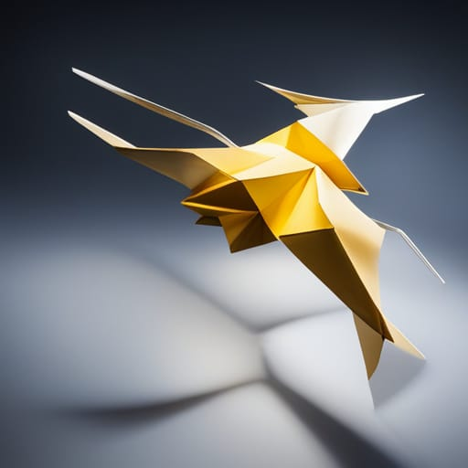

[![Contributors][contributors-shield]][contributors-url]
[![LinkedIn][linkedin-shield]][linkedin-url]
[![LinkedIn2][linkedin-shield2]][linkedin-url2]

<!-- PROJECT LOGO -->
 

  

<h3 align="center">Drone Lumineux</h3>

  

    A magic drone

<!-- TABLE OF CONTENTS -->

  
Table des matières

  <ol>
    <li>
      <a href="#Introduction">Introduction</a>
      <ul>
        <li><a href="#organigramme-des-tâches-du-projet">Organigramme des tâches du projet</a </li>
        <li><a href="#architecture-générale">Architecture générale</a </li>
      </ul>
    </li>
    <li>
      <a href="#built-with">Build with</a>
    </li>
    <li>
      <a href="#test-initaire">Test Unitaire</a>
    <ul>
        </li><a href="#ESC">ESC</a></li>
        <li><a href="#MPU6050">MPU6050</a></li>
        <li><a href="#Neopixel">Neopixel</a></li>
    </ul>

  </ol>

## Introduction  
Le projet Drone Lumineux vise à concevoir un drone équipé d'un jeu de lumières. L'objectif est de créer une expérience visuelle unique en combinant les fonctionnalités d'un drone avec des effets lumineux spectaculaires.

Pour cela,  nous avons établi notre projet en utilisant une approche agile avec Scrum et les concepts d'épique (epic), de fonctionnalité (feature) et d'histoire utilisateur (user story). 

### Organigramme des tâches du projet

![User_story]
(https://github.com/Aminekachkach/Drone_Lumineux/blob/5e0647ed3254db6fd831a457342b895aebda767c/img/Prioritization.PNG)

En ce basant le modèle, on a défini les tâches coorespondant aux user story afin d'apporter rapidement de la valeur à notre produit.

## Built With

* [![C][C.js]][C-url]
* [![Cube][Cube.js]][Cube-url]

## Test Unitaire

### ESC

### MPU6050

### Neopixel

<!-- MARKDOWN LINKS & IMAGES -->
<!-- https://www.markdownguide.org/basic-syntax/#reference-style-links -->
[contributors-shield]:https://img.shields.io/badge/CONTRIBUTORS-2-green
[contributors-url]: https://github.com/Aminekachkach/Drone_Lumineux/graphs/contributors
[linkedin-shield]: https://img.shields.io/badge/-LinkedIn-black.svg?style=for-the-badge&logo=linkedin&colorB=555
[linkedin-url]: https://www.linkedin.com/in/bilal-marecar/
[linkedin-shield2]: https://img.shields.io/badge/-LinkedIn-black.svg?style=for-the-badge&logo=linkedin&colorB=555
[linkedin-url2]: https://www.linkedin.com/in/amine-kachkach/
[product-screenshot]: images/screenshot.png
[C.js]: https://img.shields.io/badge/LanguageC-darkblue
[C-url]: https://www.gnu.org/software/gnu-c-manual/gnu-c-manual.html
[Cube.js]: https://img.shields.io/badge/STM32Cube-lightblue
[Cube-url]: https://www.st.com/en/ecosystems/stm32cube.html/

